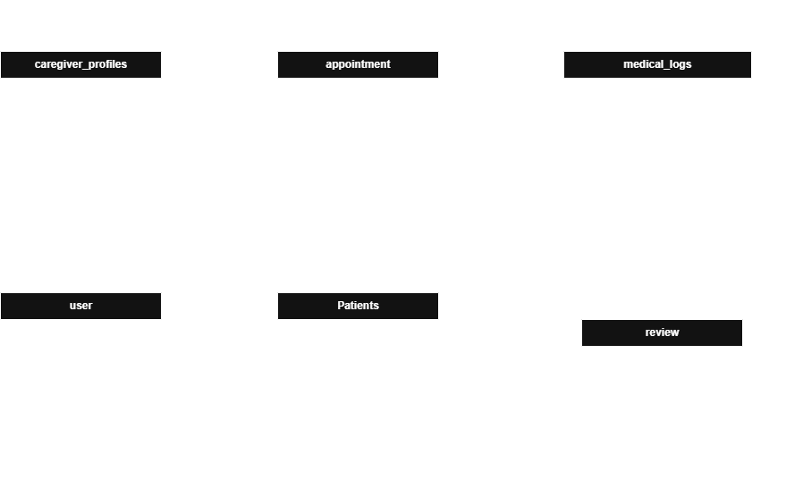

# ShifaConnect!
## Shariah-Compliant Elderly Care & Medical Companion Registry

---

# Group Members
| Name | Matric No |
|---|---|
| NUR IRDINAH BINTI MOHD ZAMANI | 2417126 |
| AINA NAJIHAH BINTI MOHAMMAD AZIZI | 2412952 |
| NUR HAZIQA AISYA BINTI KHUZAI | 2416416 |

---

# 1.0 Introduction
**ShifaConnect!** is a specialized, web-based Model-View-Controller (MVC) application engineered using the Laravel framework to digitalize and streamline home-based elderly care management. 

  Traditional care companion recruitment relies heavily on fragmented, manual communication channels such as WhatsApp or Telegram broadcasts and paper-based tracking sheets. This introduces severe risks regarding data loss, unverified credentials, scheduling conflicts, and compromised religious values. 
  
  **ShifaConnect!** addresses these structural inefficiencies by serving as a secure, centralized repository that seamlessly bridges Muslim families with certified healthcare assistants, nurses, and physiotherapists. Built on a foundational logic of Shariah compliance, the platform automates secure authentication, credential auditing, operational logs, and strict gender-matched caregiving configurations to protect patient *awrah* and family peace of mind.

  In order to deliver high performance and reliability during evaluation, the system architecture incorporates a robust core by utilizing the Laravel MVC architectural pattern built on PHP. Next, the system streamlines database management by powering data relationships, structural matching, and historical log durability via a MySQL database driven by Laravel Eloquent ORM. Lastly, the system secures the platform by restricting resource routing uniquely between Admins, Families, and Caregivers using role-based middleware.  
   
---
# 1.1 Problem Description

## 1.1.1 Background of the Problem

Currently, most Muslim families requiring home-care assistants or medical companions rely on informal recommendations through word-of-mouth or disorganized digital channels. The typical process involves making broadcast announcements on social media, posting requests in community WhatsApp groups, or contacting multiple private agencies over the phone. 

  
  Simultaneously, independent caregivers like freelance nurses or physical therapists struggle to market their services to families requiring specific medical or cultural schedules. Once hired, everyday operations such as logging patient vitals, tracking medication times, and altering appointment schedules are kept in physical paper notebooks or scattered instant messaging chats. This manual ecosystem makes it impossible for working family members to monitor their loved ones’ medical progress transparently or count on historical data reliability.

---

## 1.1.2 Problem Statement

The current manual processes in home-based elderly care suffer from four critical vulnerabilities:

1. **No Shariah-Aligned Matching:**

General healthcare directories lack gender-filtering options. This makes it difficult for Muslim families to guarantee the privacy and *awrah* protection of their bedridden relatives.

2. **Unreliable Medical Tracking:**

Relying on paper logs or unorganized text messages leads to lost data and miscommunication, leaving families without a reliable medical history for doctor reviews.

3. **High Scheduling Friction:**

Managing appointments manually via phone calls and texts frequently causes double-booking errors and wastes time with back-and-forth communication.

4. **Credential Verification Anxiety:**

Families experience safety anxieties because there is no centralized, transparent system to verify the backgrounds and professional certifications of independent caregivers.

---

# 1.2 Project Objectives

The main objective of this project is to develop **ShifaConnect!**, a Shariah-compliant web application that connects families with verified caregivers for elderly or bedridden patients.
The specific objectives are:

1. To simplify the process of finding and booking verified caregivers online.
2. To provide gender-matched caregiving services according to Islamic values.
3. To automate appointment scheduling and medical log management.
4. To provide a user-friendly dashboard for users and administrators.
5. To improve communication between caregivers and family members.

---

# 1.3 Features and Functionalities
## User Management
- User registration and login
- Profile management
- Secure authentication system

## Caregiver Management
- Create caregiver profiles
- Update caregiver availability
- Search and filtering system

## Appointment Management
- Appointment booking
- Appointment scheduling
- Booking history tracking

## Medical Log Management
- Record patient medical logs
- Update treatment records
- Monitor patient progress

## Review and Rating System
- Submit caregiver reviews
- Rating system for caregivers

## Admin Dashboard
- Manage users and caregivers
- Monitor appointments and activities
- Verify caregiver accounts

## 4(f) Entity Relationship Diagram (ERD)

---
# 1.4 Project Scope

## Scope

ShifaConnect! is a web-based MVC application designed to manage elderly care services and caregiver appointments efficiently. The system provides a centralized platform where families can search for suitable caregivers based on their preferences.

The system includes:
- User registration and login
- Caregiver profile management
- Appointment booking
- Medical log management
- Review and rating system
- Admin dashboard

The current version does not include:
- Online payment gateway
- Video consultation
- Emergency healthcare response

---
## Targeted Users

### Muslim Families
Families looking for trusted caregivers for elderly or bedridden family members.

### Professional Caregivers
Nurses, physiotherapists, and healthcare assistants offering caregiving services.

### Elderly Patients
Senior citizens requiring medical monitoring and home-care support.

### System Administrators
Users responsible for system monitoring and caregiver verification.

---

## Specific Platform

### Software Requirements
- Laravel Framework
- PHP
- HTML, CSS, JavaScript
- MySQL Database
- Visual Studio Code
- XAMPP Server
- GitHub

### Hardware Requirements
- Personal computer or laptop
- Smartphone or tablet
- Stable internet connection

### Network Requirements
- Internet connection
- Localhost server environment during development

The system will be developed and tested using XAMPP on localhost. GitHub will be used for version control and code backup.

---
# 1.5 Constraints
The development of ShifaConnect! may face several constraints during implementation. One of the main challenges is maintaining the privacy and security of patient medical records because the system handles sensitive healthcare information. Strong security measures are required to prevent unauthorized access and protect user data.
Another constraint is the verification process for caregivers. The system must ensure that all registered caregivers are trustworthy, qualified and comply with Shariah requirements such as gender-matched caregiving services. This process may require additional time and administrative monitoring.
In addition, some elderly users may have limited experience using digital platforms, which could make the system difficult for them to use independently. Internet dependency and limited development time may also affect system performance and project completion.

---

# 1.6 ERD
(Add ERD image here)

---

# 1.7 Sequence Diagram

---
# 1.8 Significance of the Project
(write here)

---

# 1.9 Summary
(write here)

---

# 1.10 References
